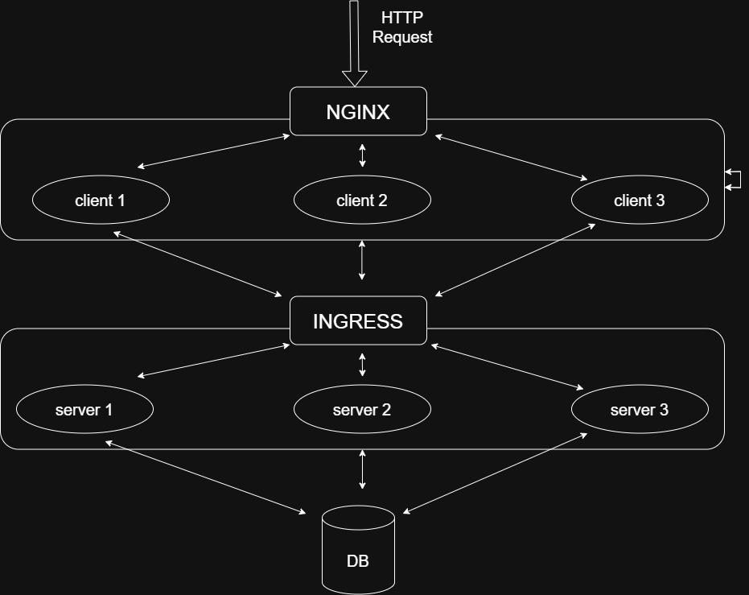

## Kubernetes Login Application (Minikube Demo)

This project is a simple demonstration of how Kubernetes works using Minikube for local development. Minikube provides a local Kubernetes cluster that closely mimics a real Kubernetes environment, making it ideal for learning and testing purposes.

The application is deployed using three independent Kubernetes pods, each serving a specific role in the system architecture.

📦 Pods and Their Responsibilities
# 1. login-client (Frontend)

- Acts as the frontend user interface
- Runs with 3 replicas for load balancing
- Handles multiple user requests efficiently
- Requests first reach an NGINX reverse proxy
- Proxy forwards traffic to the frontend pods

Purpose:
- Serve UI to users
- Distribute incoming traffic evenly across frontend replicas

# 2. login-k8 (Backend Server)

- Acts as the backend API/server
- Deployed with 3 replicas for scalability and high availability
- Uses NGINX Ingress Controller to expose backend services
- Ingress routes external requests to the correct backend pod

Purpose:
- Process client requests
- Handle business logic
- Communicate with the database

# 3. mongo (Database)

- Used as the database service
- Runs as a single instance to avoid data inconsistency
- Connected to all backend server replicas
- Stores application data

Purpose:
- Store and manage application data
- Provide a centralized data source for backend services

